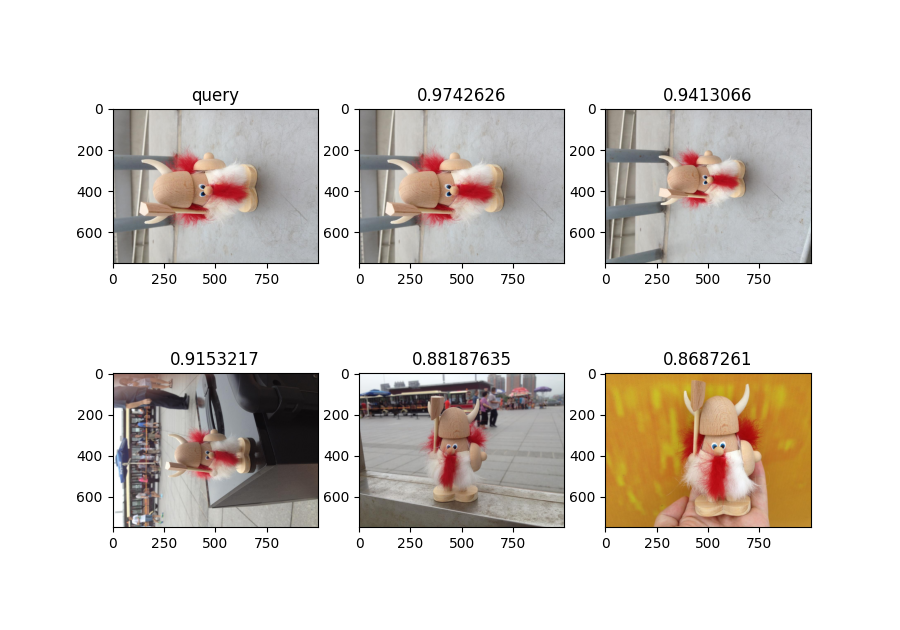

# Object Retrieval System in Image

This repository contains an implementation of an image retrieval system designed to search for and rank similar object in images from a large gallery based on query images. The system leverages two distinct methods—CNN-based feature extraction and a custom histogram-based approach—along with a combined strategy to enhance retrieval performance. It is built to process a gallery of images and return ranked results based on similarity to a given query.

## Example



## Features

- **Two Retrieval Methods**: 
  1. A CNN-based approach using a pre-trained ResNet50 model for feature extraction, paired with cosine similarity for ranking.
  2. A self-implemented color histogram method using Euclidean distance to measure similarity.
- **Combined Approach**: Integrates both methods with weighted similarity scoring for improved accuracy.
- **Modular Design**: Code is organized into separate folders for each method, making it easy to extend or modify.
- **Top-10 Results**: Outputs the top 10 most similar images from the gallery for each query.

## Repository Structure
  - `extract_feature_multi_process.py`: Feature extraction using ResNet50.
  - `all_retrieval.py`: Image retrieval and ranking using cosine similarity.


## Methodology

### Method 1: CNN-Based Retrieval (ResNet50)
This method extracts deep features from images using a pre-trained ResNet50 model and ranks gallery images based on cosine similarity.

- **Feature Extraction**:
  - Images are pre-processed (BGR to RGB conversion) using OpenCV.
  - Objects are cropped using a Fast R-CNN model when multiple instances are present.
  - ResNet50 extracts features after removing the fully connected layer, followed by global average pooling to generate a 1D feature vector.
- **Retrieval**:
  - Cosine similarity is computed between the query feature vector and gallery feature vectors.
  - Top 10 images with the highest similarity scores are returned.

### Method 2: Custom Histogram-Based Retrieval
This method uses a self-implemented color histogram algorithm to capture an object's color distribution, with similarity measured via Euclidean distance.

- **Feature Extraction**:
  - Objects are detected using Mask R-CNN.
  - A color histogram (16 bins per channel, 256 total bins) is calculated for RGB channels.

- **Retrieval**:
  - Euclidean distance is used to compare histogram feature vectors.
  - Top 10 images with the smallest distances are returned.

### Combined Approach
This method integrates features from both the CNN and histogram approaches, applying a weighted similarity score (emphasizing CNN results) to rank images.

- **Implementation**:
  - Reuses pre-extracted features from both methods.
  - Combines cosine similarity (CNN) and Euclidean distance (histogram) with a custom weighting scheme.
  - Top 10 results are generated based on the final weighted scores.

## Setup and Usage

### Prerequisites
- Python 3.x
- Libraries: OpenCV, NumPy, PyTorch (for ResNet50), and other dependencies (see `requirements.txt` if provided).
- A gallery of images (not included in this repo).

### Installation
1. Clone the repository:
   ```bash
   git clone https://github.com/yourusername/image-retrieval-system.git
   cd image-retrieval-system
   ```
2. Install dependencies:
   ```bash
   pip install -r requirements.txt
   ```
3. Add your gallery images to the `gallery/` folder and query images to the `query/` folder.

### Running the Code
- For CNN-based retrieval:
  ```bash
  python cv_assignment1_cnn/extract_feature_multi_process.py
  python cv_assignment1_cnn/all_retrieval.py
  ```
- For histogram-based retrieval:
  ```bash
  python cv_assignment1_histogram/extract_features_histogram.py
  python cv_assignment1_histogram/retrieve_distance.py
  ```
- For combined retrieval:
  ```bash
  python cv_assignment1_combined/all_retrieval.py
  ```

## Notes
- The `gallery/` folder is empty to save space. Populate it with your image dataset before running the code.
- Query images and bounding box annotations (if required) should be placed in the `query/` folder.
- Adjust file paths in the scripts if your dataset structure differs.
